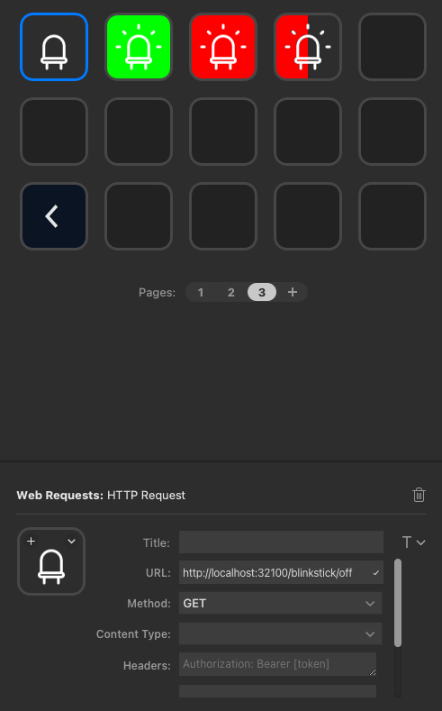

# Project StreamDeck - HTTP Request

Node script that creates local endpoints to support triggering
a 'HTTP Request' action from your Stream Deck.

Currently supports:
- Changing colours of a USB connected [Blinkstick](https://www.blinkstick.com/).
- Updating Slack messages based on button presses

## Getting Start

- `npm run start` - Run the terminal in the background

Alternatively, install [pm2](https://www.npmjs.com/package/pm2) to run the script in the background forever

- `pm2 start index.js --name "project-streamdeck-http-request"`

## Blinkstick

- Access the following URLs in your browser to test:

http://localhost:32100/blinkstick/on - Turn on your blinkstick (Green)
http://localhost:32100/blinkstick/off - Turn off your blinkstick (Black)

- Setup the following 'HTTP Request' buttons in your Stream Deck:

### Off Button

URL: `http://localhost:32100/blinkstick/off`

Icon: Use `./plugins/blinkstick/images/blinkstick-off.png`

Method: GET

### On Button

URL: `http://localhost:32100/blinkstick/on`

Icon: Use `./plugins/blinkstick/images/blinkstick-available.png`

Method: GET

### Busy Button

URL: `http://localhost:32100/blinkstick/busy`

Icon: Use `./plugins/blinkstick/images/blinkstick-busy.png`

Method: GET

### Blinking Busy Button

URL: `http://localhost:32100/blinkstick/busy/blink-on`

Icon: Use `./plugins/blinkstick/images/blinkstick-busy-blink.png`

Method: GET

## Slack Integration

This functionality helps change your Slack status when you change your Blinkstick.

It does require an API from Slack. To set this up:

- Create a new app from scratch: https://api.slack.com/apps
- Give it a name like 'StreamDeck Slack - <slack-workspace-name>' and choose the Workspace
- Go to 'oAuth & Permissions'
- Scroll down to 'User Token Scopes' and add the 'users.profile:write' 'users:write' scope - basically tells Slack you want this app to change your Slack status
- Scroll back up and 'Install to Workspace' and follow the prompts to have the app install
- This will provide a 'User OAuth Token' which you can then add to your `.env` file

