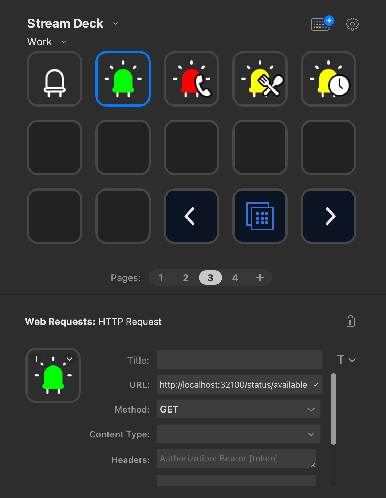

# Project StreamDeck - HTTP Request

Node script that creates local endpoints to support triggering
a 'HTTP Request' action from your [Stream Deck](https://www.elgato.com/en/stream-deck).

Currently supports:
- Changing colours of a USB connected [Blinkstick](https://www.blinkstick.com/).
- Updating Slack messages based on button presses

## Available States

When you setup this project, on button press the following will occur:

Off
- Blinklight = Turns off
- Slack Presence = Set to away

Available
- Blinklight = Green light
- Slack Presence = Set to auto/available

In Meeting
- Blinklight = Red light
- Slack Presence = Set to auto/available
- Slack Status Text= :random-meeting-emoji: In Meeting

Lunch
- Blinklight = Yellow light
- Slack Presence = Set to auto/available
- Slack Status Text = :random-food-emoji: On lunch
- Slack Status Expiry = 1 hour

Away from my deck
- Blinklight = Turns off
- Slack Presence = Set to auto/available
- Slack Status Text = :timer_clock: Away from my desk
- Slack Status Expiry = 4 hours

Be right back
- Blinklight = Yellow light
- Slack Presence = Set to auto/available
- Slack Status Text = :timer_clock: Be right back
- Slack Status Expiry = 30 mins

## Getting Start

- `npm run start` - Run the terminal in the background

Alternatively, install [pm2](https://www.npmjs.com/package/pm2) to run the script in the background forever

- `pm2 start index.js --name "project-streamdeck-http-request"`

Once the server is running you can then setup HTTP Request buttons on your Stream Deck.

## Available Endpoints

Base URL: `http://localhost:32100`

Available endpoints:

- `/status/off`
- `/status/available`
- `/status/in-meeting`
- `/status/lunch`
- `/status/away`
- `/status/brb`

- `/blinkstick/on`
- `/blinkstick/off`
- `/blinkstick/busy`
- `/blinkstick/busy/blink-on`

## Slack Integration

Updating your Slack status does require an API from Slack. To set this up:

- Create a new app from scratch: https://api.slack.com/apps
- Give it a name like 'StreamDeck Slack - <slack-workspace-name>' and choose the Workspace
- Go to 'oAuth & Permissions'
- Scroll down to 'User Token Scopes' and add the 'users.profile:write' 'users:write' scope - basically tells Slack you want this app to change your Slack status
- Scroll back up and 'Install to Workspace' and follow the prompts to have the app install
- This will provide a 'User OAuth Token' which you can then add to your `.env` file

